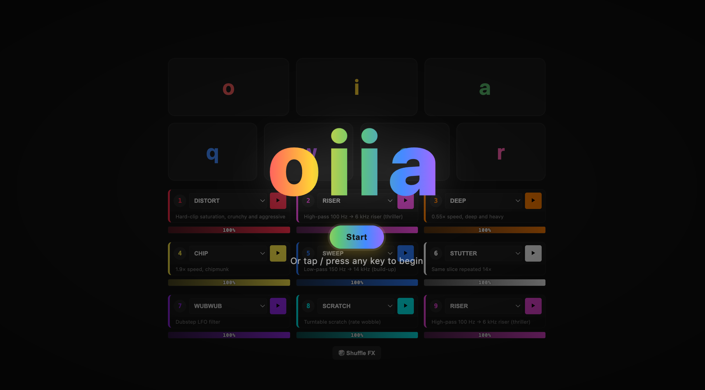

# Oiiai Keyboard

[🇰🇷 한국어 README](./README.ko.md)



> A note to the world: one year after shutting down my company, I'm doing fine.
> This is a toy I made with AI, just to have fun.

**Live → [oiia.velopert.com](https://oiia.velopert.com)**

---

Oiiai Keyboard is a browser-based musical toy built around the viral *oiiai cat* meme. Tap your keyboard, trigger syllables, fire DJ effects, and watch cats explode across the screen. It's a keyboard turned into a mini pad controller — 60+ DJ FX, BPM-locked quantization, recordable sessions, sharable presets, and a firework of cat GIFs on every hit.

## Features

- **7 sample keys** — `o` / `i` / `a` (short syllables) + `q` / `w` / `e` / `r` (longer samples with distinct cat animations)
- **9 DJ effect slots** (1–9) mapped from 60+ audio effects: distort, vinyl, siren, reverb, chop, drumroll, sub drop, granular, and many more
- **Tap-tempo BPM** + 16th-note quantized FX snapping
- **Loop layer** — record your performance and play live on top
- **One-click clip export** — writes a ~10s WebM video with FX canvas + audio burned in
- **Shareable URL presets** — BPM + DJ slot mapping + segment tuning encoded in the hash
- **Mobile-first DJ pad mode** — 3×3 grid, touch-optimized, scroll-locked
- **Advanced mode** — waveform segment editor, per-slot volume, master limiter, preset gallery
- **Dark / light theme**, **KO / EN locales**, keyboard a11y, `prefers-reduced-motion` aware

## Built by Claude Code, using `/loop`

This entire app was written by **[Claude Code](https://www.anthropic.com/claude-code)** in an autonomous **`/loop` mode** — Claude iterated 130 times, each loop producing one small, finished, screenshot-verifiable change. The human (me) set direction with short one-line feedback; Claude implemented, tested with Playwright, committed, and moved to the next loop.

The full development history lives at **[oiia.velopert.com/blog](https://oiia.velopert.com/blog)** — a prologue, nine loop-blocks, and an epilogue. Eleven posts in total, each available in both Korean and English. Worth reading: the epilogue ("at the end of 130 loops") where Claude reflects on the limits of this working style.

## Stack

- **Vite** + vanilla JS — no framework
- **Web Audio API** for all synthesis, effects, and recording
- **Canvas** for visual FX
- **Playwright** for E2E regression (desktop + mobile viewports)
- **Cloudflare Pages** for hosting
- Custom static blog generator (`scripts/build-blog.js`) for the devlogs

## Development

```bash
npm install
npm run dev          # http://localhost:5174
npm run build        # Blog + app → dist/
npm run build:blog   # Blog only → public/blog/
npm run test         # Playwright regression
```

## Deploy

```bash
npm run build
npx wrangler pages deploy dist --project-name oiiai --branch main
```

`CLOUDFLARE_API_TOKEN` and `CLOUDFLARE_ACCOUNT_ID` in `.env`.

## Credits

- **Oiiai Cat** — the internet
- **Human** — direction, feedback, curation, deployment, and cat GIF tuning
- **Claude Code (Opus 4.7, 1M context)** — wrote the code, one loop at a time

## License

MIT. The cat is not mine.
